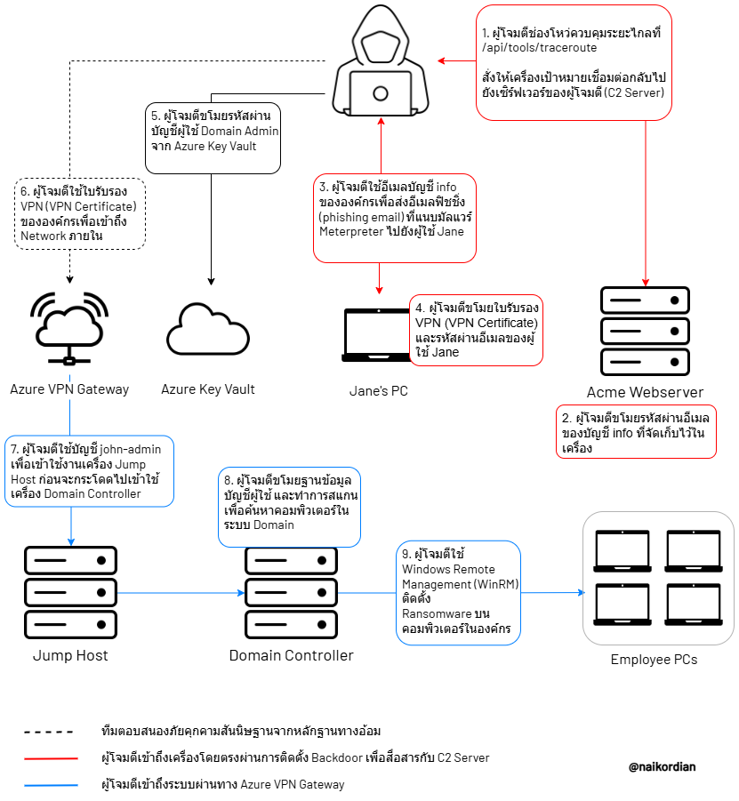

## Intro

เมื่อประมาณปีที่แล้ว ผมมีโอกาสได้เข้าร่วมการแข่งขัน CTF ในหมวด Digital Forensics and Incident Response (DFIR) ที่จัดโดยทีม [Black Cell](https://blackcell.io/) ซึ่งตัว CTF ได้จำลองเหตุการณ์การโจมตีได้อย่างสมจริง พร้อมทั้งมีการให้หลักฐานที่ครบถ้วน

เนื่องจาก Incident Report เป็นสิ่งที่หาอ่านได้ยากบนอินเทอร์เน็ต เพราะมักเกี่ยวข้องกับข้อมูลภายในขององค์กรที่ถือเป็นความลับและไม่สามารถเปิดเผยต่อสาธารณะได้ ผมจึงถือโอกาสใช้ข้อมูลจากโจทย์ CTF ครั้งนี้ในการเขียน Incident Report เพื่อเป็นแหล่งเรียนรู้สำหรับผู้ที่สนใจด้าน DFIR

 

## Report

<image-caption>รูปที่ 1: เส้นทางการโจมตี</image-caption>

Report: https://github.com/naikordian/public/blob/main/incident-report/Incident_Report_SecOps_2024_CTF_TH.pdf

Investigation Timeline: https://docs.google.com/spreadsheets/d/e/2PACX-1vTTQ1SuDaTi9wYbCvUpEaLuRWnZmls773x78RJwEhdB99r0PiHb7Iybc1YCmrv5kQ/pubhtml